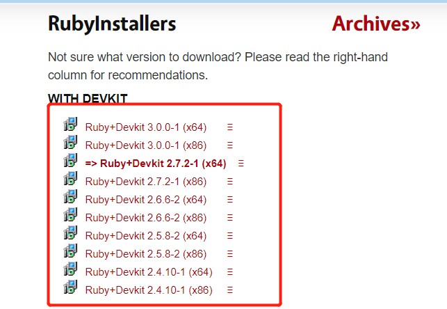

# windows安装jekyll步骤及问题

#### 1.安装Ruby和DevKit

下载地址：https://rubyinstaller.org/downloads/



#### 2.安装jekyll

```java
gem install jekyll
```

测试一下

```java
jekyll --version
```

新建项目

```
jekyll new myblog
```

#### 3.运行服务器

进入myblog

```
cd myblog

myblog>jekyll serve
```

